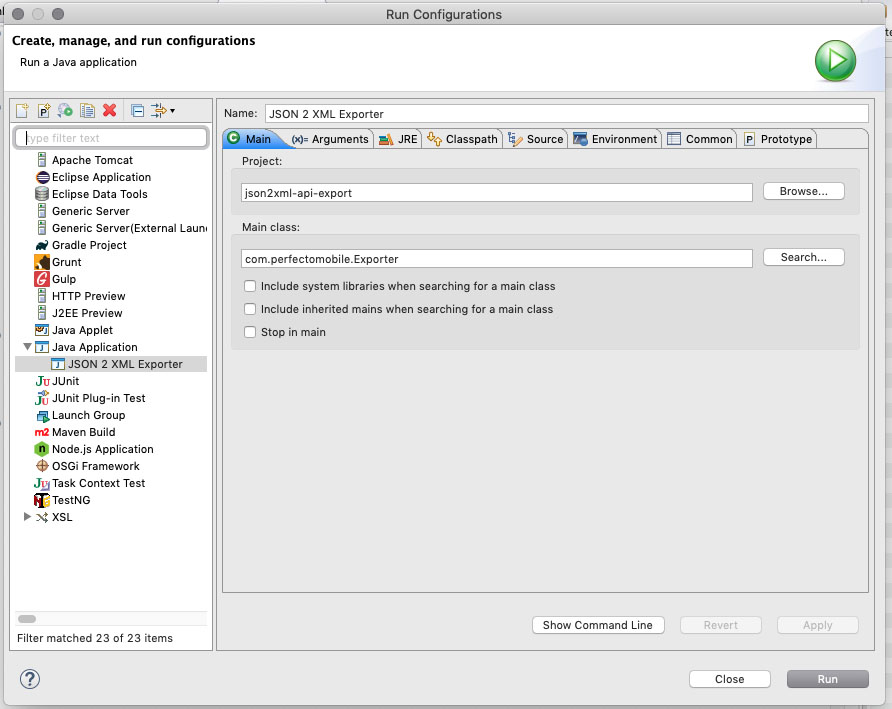
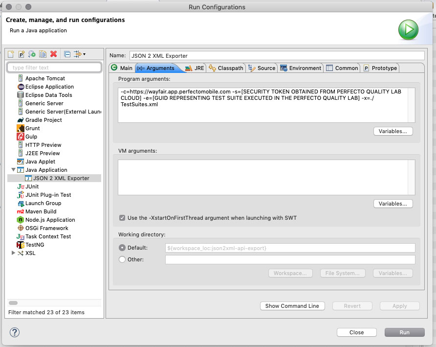

Perfecto Reporting API JSON to Junit XML Exporter
=
This command line interface is designed to extract XCTest and Espresso test execution results for a single test suite from the Perfect Reporting API via REST and convert the resulting JSON to Junit XML and write it to a file.

Usage
=
Either run at the command line:

> com.perfectomobile.Exporter -c=https://example.app.perfectomobile.com -s=[SECURITY TOKEN OBTAINED FROM PERFECTO QUALITY LAB CLOUD] -e=[GUID REPRESENTING TEST SUITE EXECUTED IN THE PERFECTO QUALITY LAB] -x=./TestSuites.xml

Or create an Eclipse run configuration:

There are four command line parameters (all required strings):
* c | perfectoCloudReportingServer
    * Example: -c=https://example.app.perfectomobile.com
* s | perfectoSecurityToken
    * Example: -s=[SECURITY TOKEN OBTAINED FROM PERFECTO QUALITY LAB CLOUD]
* e | testExecutionId
    * Example: -e=[GUID REPRESENTING TEST SUITE EXECUTED IN THE PERFECTO QUALITY LAB]
* x | xmlOutputFilePath
    * Example: -x=./TestSuites.xml

Reference
=
[Perfecto API documentation](https://developers.perfectomobile.com/display/PD/DigitalZoom+Reporting+Public+API)

[Junit XML reference](https://llg.cubic.org/docs/junit/)

Special Thanks
--
The core of the TestUnits XML class used to serialize the results was borrowed from [Adam Gent](https://gist.github.com/agentgt/8583649).
